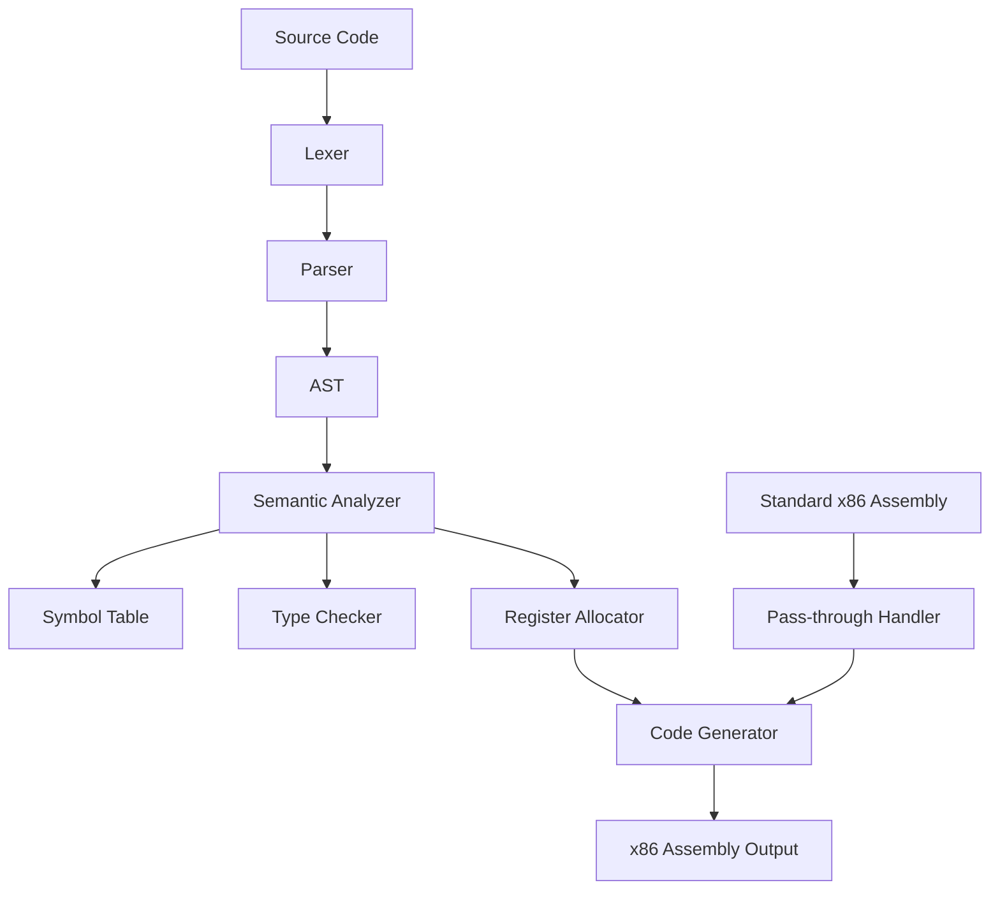

# Design Document

## Overview

The x86 Assembly Fork (working name: "MethASM") is a transpiler that extends x86 assembly with high-level programming constructs while maintaining full backward compatibility. The system consists of a lexer, parser, semantic analyzer, and code generator that transforms the enhanced syntax into standard x86 assembly code.

The design follows a multi-pass compilation approach:
1. **Lexical Analysis**: Tokenize the enhanced assembly syntax
2. **Parsing**: Build an Abstract Syntax Tree (AST) from tokens
3. **Semantic Analysis**: Type checking, symbol resolution, and register allocation
4. **Code Generation**: Transform AST to standard x86 assembly

## Architecture

### Core Components



### Language Grammar

The enhanced syntax extends standard x86 assembly with these constructs:

```ebnf
program = { declaration | statement | asm_instruction }

declaration = var_declaration | function_declaration | struct_declaration

var_declaration = "var" identifier [ ":" type ] [ "=" expression ]

function_declaration = "function" identifier "(" parameter_list ")" [ "->" type ] block

struct_declaration = "struct" identifier "{" field_list [ method_list ] "}"

method_declaration = "method" identifier "(" parameter_list ")" [ "->" type ] block

parameter_list = [ parameter { "," parameter } ]
parameter = identifier ":" type

type = "int8" | "int16" | "int32" | "int64" | "uint8" | "uint16" | "uint32" | "uint64" | "float32" | "float64" | "string" | identifier

block = "{" { statement } "}"

statement = assignment | function_call | return_statement | if_statement | while_statement | asm_block

asm_block = "asm" "{" { asm_instruction } "}"
```

## Components and Interfaces

### 1. Lexer (Tokenizer)

**Purpose**: Convert source code into tokens for parsing

**Interface**:
```typescript
interface Token {
  type: TokenType;
  value: string;
  line: number;
  column: number;
}

class Lexer {
  tokenize(source: string): Token[];
  nextToken(): Token;
  peek(): Token;
}
```

**Key Features**:
- Recognizes both enhanced syntax keywords and standard x86 mnemonics
- Handles string literals with escape sequences
- Supports both C-style and assembly-style comments
- Maintains position information for error reporting

### 2. Parser

**Purpose**: Build Abstract Syntax Tree from tokens

**Interface**:
```typescript
interface ASTNode {
  type: string;
  location: SourceLocation;
}

class Parser {
  parse(tokens: Token[]): ProgramNode;
  parseDeclaration(): DeclarationNode;
  parseStatement(): StatementNode;
  parseExpression(): ExpressionNode;
}
```

**AST Node Types**:
- `ProgramNode`: Root node containing all declarations and statements
- `VarDeclarationNode`: Variable declarations with optional type and initializer
- `FunctionDeclarationNode`: Function definitions with parameters and body
- `StructDeclarationNode`: Struct definitions with fields and methods
- `CallExpressionNode`: Function/method calls
- `AssignmentNode`: Variable assignments
- `InlineAsmNode`: Raw assembly code blocks

### 3. Symbol Table

**Purpose**: Track variable, function, and type declarations across scopes

**Interface**:
```typescript
interface Symbol {
  name: string;
  type: Type;
  scope: Scope;
  location: MemoryLocation | Register;
  isInitialized: boolean;
}

class SymbolTable {
  enterScope(): void;
  exitScope(): void;
  declare(symbol: Symbol): void;
  lookup(name: string): Symbol | null;
  getCurrentScope(): Scope;
}
```

**Features**:
- Hierarchical scope management (global, function, block)
- Type information storage
- Memory location tracking
- Forward declaration support

### 4. Type System

**Purpose**: Provide type checking and inference

**Built-in Types**:
- Integer types: `int8`, `int16`, `int32`, `int64`, `uint8`, `uint16`, `uint32`, `uint64`
- Floating-point: `float32`, `float64`
- String type: `string` (null-terminated char array)
- Pointer types: `*type`
- Array types: `[size]type`
- User-defined structs

**Type Inference Rules**:
- Integer literals default to `int32`
- Floating literals default to `float64`
- String literals are `string` type
- Arithmetic operations promote to larger type
- Comparison operations return boolean (represented as `int8`)

### 5. Register Allocator

**Purpose**: Automatically assign variables to registers or memory

**Strategy**: Linear scan register allocation with spilling

**Interface**:
```typescript
interface RegisterAllocation {
  variable: string;
  register?: x86Register;
  memoryOffset?: number;
  spillLocation?: number;
}

class RegisterAllocator {
  allocateRegisters(function: FunctionNode): RegisterAllocation[];
  spillVariable(variable: string): void;
  getLocation(variable: string): MemoryLocation | Register;
}
```

**Register Usage**:
- General purpose registers: RAX, RBX, RCX, RDX, RSI, RDI, R8-R15
- Floating-point registers: XMM0-XMM15
- Calling convention compliance (System V ABI for Linux, Microsoft x64 for Windows)

### 6. Code Generator

**Purpose**: Transform AST into x86 assembly code

**Interface**:
```typescript
class CodeGenerator {
  generate(ast: ProgramNode): string;
  generateFunction(func: FunctionDeclarationNode): string;
  generateExpression(expr: ExpressionNode): string;
  generateStatement(stmt: StatementNode): string;
}
```

## Data Models

### Variable Storage

Variables are stored based on their scope and usage patterns:

1. **Global Variables**: Stored in `.data` or `.bss` sections
2. **Local Variables**: Allocated on stack frame or in registers
3. **Function Parameters**: Passed via registers (following calling convention) or stack
4. **Struct Fields**: Stored with proper alignment and padding

### Function Call Convention

The system follows standard calling conventions but abstracts them:

**Linux (System V ABI)**:
- Integer/pointer args: RDI, RSI, RDX, RCX, R8, R9, then stack
- Floating-point args: XMM0-XMM7, then stack
- Return values: RAX (integer), XMM0 (float)

**Windows (Microsoft x64)**:
- First 4 args: RCX, RDX, R8, R9, then stack
- Floating-point: XMM0-XMM3
- Return values: RAX (integer), XMM0 (float)

### Memory Layout

```
Stack Frame Layout:
+------------------+ <- RBP + 16
| Return Address   |
+------------------+ <- RBP + 8
| Saved RBP        |
+------------------+ <- RBP (Frame Pointer)
| Local Variables  |
+------------------+
| Spilled Registers|
+------------------+
| Temporary Space  |
+------------------+ <- RSP (Stack Pointer)
```

## Error Handling

### Compile-Time Errors

1. **Syntax Errors**: Invalid token sequences, missing semicolons, unmatched braces
2. **Type Errors**: Type mismatches, undefined variables, invalid operations
3. **Semantic Errors**: Duplicate declarations, undefined functions, scope violations

**Error Reporting Format**:
```
error: type mismatch in assignment
  --> example.masm:15:8
   |
15 |     var x: int32 = "hello";
   |        ^^^^^^^^^^ expected int32, found string
```

### Runtime Error Support

Generated code includes optional runtime checks:
- Stack overflow detection
- Null pointer dereference protection
- Array bounds checking (when array types are used)
- Division by zero checks

## Testing Strategy

### Unit Testing

1. **Lexer Tests**: Token recognition, position tracking, error handling
2. **Parser Tests**: AST construction, syntax error recovery
3. **Type Checker Tests**: Type inference, error detection
4. **Code Generator Tests**: Correct assembly output, optimization verification

### Integration Testing

1. **End-to-End Compilation**: Source code → executable binary
2. **Compatibility Tests**: Mixed high-level and low-level code
3. **Performance Tests**: Register allocation efficiency, code size optimization

### Test Categories

1. **Positive Tests**: Valid programs that should compile and run correctly
2. **Negative Tests**: Invalid programs that should produce specific error messages
3. **Edge Cases**: Boundary conditions, complex type interactions
4. **Regression Tests**: Previously fixed bugs to prevent reintroduction

### Example Test Cases

```masm
// Variable declaration and initialization
var counter: int32 = 0;
var message = "Hello, World!";  // Type inference

// Function definition
function fibonacci(n: int32) -> int32 {
    if (n <= 1) return n;
    return fibonacci(n-1) + fibonacci(n-2);
}

// Struct with methods
struct Point {
    x: float64;
    y: float64;
    
    method distance() -> float64 {
        return sqrt(this.x * this.x + this.y * this.y);
    }
}

// Mixed with inline assembly
function optimized_multiply(a: int32, b: int32) -> int32 {
    var result: int32;
    asm {
        mov eax, a
        imul eax, b
        mov result, eax
    }
    return result;
}
```

This design provides a solid foundation for implementing the enhanced x86 assembly language while maintaining the performance and control that assembly programmers expect.