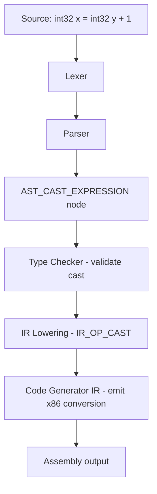

# Plan: Add Explicit Cast Syntax `(Type)value`

## Overview

Methlang's documentation mentions explicit cast syntax but the parser does not support it. This plan adds full support for `(Type)expr` cast expressions, covering:

1. AST node definition
2. Parser disambiguation (cast vs. grouped expression)
3. Type-checker validation
4. IR lowering (new `IR_OP_CAST` opcode)
5. x86-64 code generation (integer widening/narrowing, int↔float, pointer reinterpretation)
6. All secondary passes (monomorphize, import resolver, register allocator)
7. Documentation and tests

---

## Architecture



---

## Supported Cast Conversions

| From \ To | int8-int64 | uint8-uint64 | float32 | float64 | pointer |
|-----------|-----------|--------------|---------|---------|---------|
| int8-int64 | ✓ sign-extend/truncate | ✓ zero-extend/truncate | ✓ cvtsi2ss/sd | ✓ cvtsi2sd | ✓ reinterpret |
| uint8-uint64 | ✓ zero-extend/truncate | ✓ zero-extend/truncate | ✓ cvtsi2ss/sd | ✓ cvtsi2sd | ✓ reinterpret |
| float32 | ✓ cvttss2si | ✓ cvttss2si | ✓ no-op | ✓ cvtss2sd | ✗ |
| float64 | ✓ cvttsd2si | ✓ cvttsd2si | ✓ cvtsd2ss | ✓ no-op | ✗ |
| pointer | ✓ reinterpret | ✓ reinterpret | ✗ | ✗ | ✓ reinterpret |

**Disallowed casts:** float↔pointer, struct↔anything, array↔anything.

---

## Detailed Steps

### Step 1: AST Node — `src/parser/ast.h` and `src/parser/ast.c`

**`ast.h`:**
- Add `AST_CAST_EXPRESSION` to the `ASTNodeType` enum (after `AST_NEW_EXPRESSION`).
- Add `CastExpression` struct:
  ```c
  typedef struct {
    char *type_name;   // Target type string, e.g. "int32", "uint8*"
    ASTNode *operand;  // Expression being cast
  } CastExpression;
  ```
- Add declaration: `ASTNode *ast_create_cast_expression(const char *type_name, ASTNode *operand, SourceLocation location);`

**`ast.c`:**
- Implement `ast_create_cast_expression()` — allocates a `CastExpression`, sets `type_name` and `operand`, adds operand as child.
- Add `case AST_CAST_EXPRESSION:` to `ast_clone_node()` — deep-copies `type_name` and clones `operand`.
- Add `case AST_CAST_EXPRESSION:` to `ast_destroy_node()` — frees `type_name` (operand freed via children).

### Step 2: Parser — `src/parser/parser.c`

The challenge is disambiguating `(Type)expr` from `(expr)`. The parser uses a 2-token lookahead (`current_token` + `peek_token`). We need a speculative parse.

**Strategy:** In `parser_parse_unary_expression()`, before falling through to `parser_parse_postfix_expression()`, check:
- If `current_token == TOKEN_LPAREN`
- AND `peek_token` is a type keyword (`parser_is_type_keyword()`) or an identifier that could be a type name

If so, attempt a speculative parse:
1. Save lexer state (position, line, column, current/peek tokens, error state).
2. Consume `(`, parse a type annotation via `parser_parse_type_annotation()`.
3. Check for `)`.
4. Check that the next token is NOT `TOKEN_RPAREN`, `TOKEN_COMMA`, `TOKEN_SEMICOLON`, `TOKEN_EOF`, or a binary operator (which would indicate a grouped expression, not a cast).
5. If all checks pass: consume `)`, parse the operand expression via `parser_parse_unary_expression()`, return `AST_CAST_EXPRESSION`.
6. If any check fails: restore lexer state and fall through to normal `(expr)` parsing.

This mirrors the existing `parser_try_parse_generic_call_type_args()` pattern.

**Add to `parser.h`:** `ASTNode *parser_parse_cast_expression(Parser *parser);`

### Step 3: Type Checker — `src/semantic/type_checker.c`

Add `case AST_CAST_EXPRESSION:` to `type_checker_infer_type_internal()`:

1. Extract `CastExpression *cast = (CastExpression *)expression->data`.
2. Resolve `cast->type_name` via `type_checker_get_type_by_name()` → `target_type`.
3. Infer `operand_type` via `type_checker_infer_type(checker, cast->operand)`.
4. Validate the cast is legal:
   - **Numeric ↔ numeric:** always allowed (int↔int, int↔float, float↔float).
   - **Pointer ↔ pointer:** always allowed (reinterpretation).
   - **Integer ↔ pointer:** allowed (for low-level code).
   - **Float ↔ pointer:** error.
   - **Struct/array involved:** error.
5. Return `target_type` on success, `NULL` with error on failure.

Add a helper `type_checker_is_cast_valid(Type *from, Type *to)` that encodes the above rules.

### Step 4: IR — `src/ir/ir.h` and `src/ir/ir_lowering.c` and `src/ir/ir.c`

**`ir.h`:**
- Add `IR_OP_CAST` to `IROpcode` enum.
- The `IRInstruction` for a cast uses:
  - `op = IR_OP_CAST`
  - `dest` = result temp
  - `lhs` = operand value
  - `text` = target type name (e.g. `"int32"`, `"float64"`, `"uint8*"`)
  - `is_float` = 1 if the **result** type is floating-point

**`ir_lowering.c`:**
- Add `case AST_CAST_EXPRESSION:` to `ir_lower_expression()`:
  1. Lower `cast->operand` → `operand_value`.
  2. Allocate a temp `destination`.
  3. Emit `IR_OP_CAST` with `lhs = operand_value`, `text = cast->type_name`, `is_float = (target is float)`.
  4. Set `*out_value = destination`.

**`ir.c`:**
- Add `case IR_OP_CAST:` to `ir_program_dump()` for debug output.

### Step 5: Code Generator — `src/codegen/code_generator_ir.c`

Add a handler for `IR_OP_CAST` in the IR instruction dispatch. The handler:

1. Loads the operand into `rax` (or `xmm0` if float source).
2. Determines source type from the operand (via symbol table or `is_float` flag on the instruction).
3. Determines target type from `instruction->text`.
4. Emits the appropriate x86-64 instruction:

| Source → Target | Instruction |
|-----------------|-------------|
| int → wider int (signed) | `movsx rax, eax` / `movsxd rax, eax` |
| int → wider int (unsigned) | `movzx rax, eax` |
| int → narrower int | truncate (just use lower register, e.g. `movzx eax, al`) |
| int → float32 | `cvtsi2ss xmm0, rax` then `movd rax, xmm0` |
| int → float64 | `cvtsi2sd xmm0, rax` then `movq rax, xmm0` |
| float32 → int | `movd xmm0, eax` then `cvttss2si rax, xmm0` |
| float64 → int | `movq xmm0, rax` then `cvttsd2si rax, xmm0` |
| float32 → float64 | `movd xmm0, eax` then `cvtss2sd xmm0, xmm0` then `movq rax, xmm0` |
| float64 → float32 | `movq xmm0, rax` then `cvtsd2ss xmm0, xmm0` then `movd rax, xmm0` |
| pointer → pointer | no-op (same 64-bit value) |
| int → pointer | no-op (same 64-bit value) |
| pointer → int | no-op (same 64-bit value) |

### Step 6: Code Generator Expression Dispatch — `src/codegen/code_generator_flow.c`

Add `case AST_CAST_EXPRESSION:` to `code_generator_generate_expression()`:
- Extract `CastExpression *cast`.
- Generate the operand expression.
- Determine source and target types.
- Emit the conversion inline (or call a helper that mirrors the IR handler logic).

### Step 7: Type Inference in Code Generator — `src/codegen/code_generator_calls.c`

Add `case AST_CAST_EXPRESSION:` to `code_generator_infer_expression_type()`:
- Resolve `cast->type_name` via `type_checker_get_type_by_name()` and return it.

### Step 8: Monomorphizer — `src/semantic/monomorphize.c`

Add `case AST_CAST_EXPRESSION:` to `substitute_types_in_ast()`:
- Substitute the `type_name` string (it may contain a generic type parameter).
- Recurse into `operand`.

### Step 9: Import Resolver — `src/semantic/import_resolver.c`

Add `case AST_CAST_EXPRESSION:` to `process_import_strs_in_node()`:
- Recurse into `cast->operand`.

### Step 10: Register Allocator — `src/semantic/register_allocator.c`

Add `case AST_CAST_EXPRESSION:` to `register_allocator_analyze_live_intervals()`:
- Recurse into `cast->operand`.

### Step 11: Documentation

**`docs/expressions.md`:**
- Add a "Cast Expressions" section documenting `(Type)expr` syntax, precedence (same as unary), and examples.

**`docs/types.md`:**
- Update the "Type Conversions" section to replace the "no explicit cast syntax" note with documentation of the new `(Type)expr` syntax and the allowed/disallowed conversions.

### Step 12: Tests

Add `tests/test_cast_expression.meth` covering:
- Integer narrowing: `(int8)someInt32`
- Integer widening: `(int64)someInt32`
- Signed/unsigned: `(uint32)someInt32`
- Int to float: `(float64)someInt32`
- Float to int: `(int32)someFloat64`
- Float32 ↔ float64: `(float32)someFloat64`
- Pointer reinterpretation: `(uint8*)someInt32Ptr`
- Integer ↔ pointer: `(int64)somePointer`

---

## Key Design Decisions

1. **Disambiguation:** The parser uses speculative parsing (save/restore state) to distinguish `(Type)expr` from `(expr)`. The heuristic: after `(TypeName)`, if the next token can start an expression (identifier, number, string, `(`, unary operator), it's a cast. Otherwise it's a grouped expression.

2. **No new IR opcode for simple reinterpretations:** Pointer-to-pointer and int-to-pointer casts are no-ops at the IR level (same 64-bit value). Only numeric conversions need actual instructions.

3. **`is_float` flag on `IR_OP_CAST`:** Indicates whether the **result** is floating-point, which determines which XMM register path to use in the code generator.

4. **`text` field stores target type name:** Reuses the existing `text` field in `IRInstruction` to carry the target type name string, consistent with how `IR_OP_NEW` uses it for the allocated type name.

5. **Pointer casts are always allowed:** This is a systems language; pointer reinterpretation is a legitimate operation. The type checker allows any pointer-to-pointer cast and integer-to-pointer cast.

## Overview

Methlang's documentation mentions explicit cast syntax but the parser does not support it. This plan adds full support for `(Type)expr` cast expressions, covering:

1. AST node definition
2. Parser disambiguation (cast vs. grouped expression)
3. Type-checker validation
4. IR lowering (new `IR_OP_CAST` opcode)
5. x86-64 code generation (integer widening/narrowing, int↔float, pointer reinterpretation)
6. All secondary passes (monomorphize, import resolver, register allocator)
7. Documentation and tests

---

## Architecture


---

## Supported Cast Conversions

| From \ To | int8-int64 | uint8-uint64 | float32 | float64 | pointer |
|-----------|-----------|--------------|---------|---------|---------|
| int8-int64 | ✓ sign-extend/truncate | ✓ zero-extend/truncate | ✓ cvtsi2ss/sd | ✓ cvtsi2sd | ✓ reinterpret |
| uint8-uint64 | ✓ zero-extend/truncate | ✓ zero-extend/truncate | ✓ cvtsi2ss/sd | ✓ cvtsi2sd | ✓ reinterpret |
| float32 | ✓ cvttss2si | ✓ cvttss2si | ✓ no-op | ✓ cvtss2sd | ✗ |
| float64 | ✓ cvttsd2si | ✓ cvttsd2si | ✓ cvtsd2ss | ✓ no-op | ✗ |
| pointer | ✓ reinterpret | ✓ reinterpret | ✗ | ✗ | ✓ reinterpret |

**Disallowed casts:** float↔pointer, struct↔anything, array↔anything.

---

## Detailed Steps

### Step 1: AST Node — `src/parser/ast.h` and `src/parser/ast.c`

**`ast.h`:**
- Add `AST_CAST_EXPRESSION` to the `ASTNodeType` enum (after `AST_NEW_EXPRESSION`).
- Add `CastExpression` struct:
  ```c
  typedef struct {
    char *type_name;   // Target type string, e.g. "int32", "uint8*"
    ASTNode *operand;  // Expression being cast
  } CastExpression;
  ```
- Add declaration: `ASTNode *ast_create_cast_expression(const char *type_name, ASTNode *operand, SourceLocation location);`

**`ast.c`:**
- Implement `ast_create_cast_expression()` — allocates a `CastExpression`, sets `type_name` and `operand`, adds operand as child.
- Add `case AST_CAST_EXPRESSION:` to `ast_clone_node()` — deep-copies `type_name` and clones `operand`.
- Add `case AST_CAST_EXPRESSION:` to `ast_destroy_node()` — frees `type_name` (operand freed via children).

### Step 2: Parser — `src/parser/parser.c`

The challenge is disambiguating `(Type)expr` from `(expr)`. The parser uses a 2-token lookahead (`current_token` + `peek_token`). We need a speculative parse.

**Strategy:** In `parser_parse_unary_expression()`, before falling through to `parser_parse_postfix_expression()`, check:
- If `current_token == TOKEN_LPAREN`
- AND `peek_token` is a type keyword (`parser_is_type_keyword()`) or an identifier that could be a type name

If so, attempt a speculative parse:
1. Save lexer state (position, line, column, current/peek tokens, error state).
2. Consume `(`, parse a type annotation via `parser_parse_type_annotation()`.
3. Check for `)`.
4. Check that the next token is NOT `TOKEN_RPAREN`, `TOKEN_COMMA`, `TOKEN_SEMICOLON`, `TOKEN_EOF`, or a binary operator (which would indicate a grouped expression, not a cast).
5. If all checks pass: consume `)`, parse the operand expression via `parser_parse_unary_expression()`, return `AST_CAST_EXPRESSION`.
6. If any check fails: restore lexer state and fall through to normal `(expr)` parsing.

This mirrors the existing `parser_try_parse_generic_call_type_args()` pattern.

**Add to `parser.h`:** `ASTNode *parser_parse_cast_expression(Parser *parser);`

### Step 3: Type Checker — `src/semantic/type_checker.c`

Add `case AST_CAST_EXPRESSION:` to `type_checker_infer_type_internal()`:

1. Extract `CastExpression *cast = (CastExpression *)expression->data`.
2. Resolve `cast->type_name` via `type_checker_get_type_by_name()` → `target_type`.
3. Infer `operand_type` via `type_checker_infer_type(checker, cast->operand)`.
4. Validate the cast is legal:
   - **Numeric ↔ numeric:** always allowed (int↔int, int↔float, float↔float).
   - **Pointer ↔ pointer:** always allowed (reinterpretation).
   - **Integer ↔ pointer:** allowed (for low-level code).
   - **Float ↔ pointer:** error.
   - **Struct/array involved:** error.
5. Return `target_type` on success, `NULL` with error on failure.

Add a helper `type_checker_is_cast_valid(Type *from, Type *to)` that encodes the above rules.

### Step 4: IR — `src/ir/ir.h` and `src/ir/ir_lowering.c` and `src/ir/ir.c`

**`ir.h`:**
- Add `IR_OP_CAST` to `IROpcode` enum.
- The `IRInstruction` for a cast uses:
  - `op = IR_OP_CAST`
  - `dest` = result temp
  - `lhs` = operand value
  - `text` = target type name (e.g. `"int32"`, `"float64"`, `"uint8*"`)
  - `is_float` = 1 if the **result** type is floating-point

**`ir_lowering.c`:**
- Add `case AST_CAST_EXPRESSION:` to `ir_lower_expression()`:
  1. Lower `cast->operand` → `operand_value`.
  2. Allocate a temp `destination`.
  3. Emit `IR_OP_CAST` with `lhs = operand_value`, `text = cast->type_name`, `is_float = (target is float)`.
  4. Set `*out_value = destination`.

**`ir.c`:**
- Add `case IR_OP_CAST:` to `ir_program_dump()` for debug output.

### Step 5: Code Generator — `src/codegen/code_generator_ir.c`

Add a handler for `IR_OP_CAST` in the IR instruction dispatch. The handler:

1. Loads the operand into `rax` (or `xmm0` if float source).
2. Determines source type from the operand (via symbol table or `is_float` flag on the instruction).
3. Determines target type from `instruction->text`.
4. Emits the appropriate x86-64 instruction:

| Source → Target | Instruction |
|-----------------|-------------|
| int → wider int (signed) | `movsx rax, eax` / `movsxd rax, eax` |
| int → wider int (unsigned) | `movzx rax, eax` |
| int → narrower int | truncate (just use lower register, e.g. `movzx eax, al`) |
| int → float32 | `cvtsi2ss xmm0, rax` then `movd rax, xmm0` |
| int → float64 | `cvtsi2sd xmm0, rax` then `movq rax, xmm0` |
| float32 → int | `movd xmm0, eax` then `cvttss2si rax, xmm0` |
| float64 → int | `movq xmm0, rax` then `cvttsd2si rax, xmm0` |
| float32 → float64 | `movd xmm0, eax` then `cvtss2sd xmm0, xmm0` then `movq rax, xmm0` |
| float64 → float32 | `movq xmm0, rax` then `cvtsd2ss xmm0, xmm0` then `movd rax, xmm0` |
| pointer → pointer | no-op (same 64-bit value) |
| int → pointer | no-op (same 64-bit value) |
| pointer → int | no-op (same 64-bit value) |

### Step 6: Code Generator Expression Dispatch — `src/codegen/code_generator_flow.c`

Add `case AST_CAST_EXPRESSION:` to `code_generator_generate_expression()`:
- Extract `CastExpression *cast`.
- Generate the operand expression.
- Determine source and target types.
- Emit the conversion inline (or call a helper that mirrors the IR handler logic).

### Step 7: Type Inference in Code Generator — `src/codegen/code_generator_calls.c`

Add `case AST_CAST_EXPRESSION:` to `code_generator_infer_expression_type()`:
- Resolve `cast->type_name` via `type_checker_get_type_by_name()` and return it.

### Step 8: Monomorphizer — `src/semantic/monomorphize.c`

Add `case AST_CAST_EXPRESSION:` to `substitute_types_in_ast()`:
- Substitute the `type_name` string (it may contain a generic type parameter).
- Recurse into `operand`.

### Step 9: Import Resolver — `src/semantic/import_resolver.c`

Add `case AST_CAST_EXPRESSION:` to `process_import_strs_in_node()`:
- Recurse into `cast->operand`.

### Step 10: Register Allocator — `src/semantic/register_allocator.c`

Add `case AST_CAST_EXPRESSION:` to `register_allocator_analyze_live_intervals()`:
- Recurse into `cast->operand`.

### Step 11: Documentation

**`docs/expressions.md`:**
- Add a "Cast Expressions" section documenting `(Type)expr` syntax, precedence (same as unary), and examples.

**`docs/types.md`:**
- Update the "Type Conversions" section to replace the "no explicit cast syntax" note with documentation of the new `(Type)expr` syntax and the allowed/disallowed conversions.

### Step 12: Tests

Add `tests/test_cast_expression.meth` covering:
- Integer narrowing: `(int8)someInt32`
- Integer widening: `(int64)someInt32`
- Signed/unsigned: `(uint32)someInt32`
- Int to float: `(float64)someInt32`
- Float to int: `(int32)someFloat64`
- Float32 ↔ float64: `(float32)someFloat64`
- Pointer reinterpretation: `(uint8*)someInt32Ptr`
- Integer ↔ pointer: `(int64)somePointer`

---

## Key Design Decisions

1. **Disambiguation:** The parser uses speculative parsing (save/restore state) to distinguish `(Type)expr` from `(expr)`. The heuristic: after `(TypeName)`, if the next token can start an expression (identifier, number, string, `(`, unary operator), it's a cast. Otherwise it's a grouped expression.

2. **No new IR opcode for simple reinterpretations:** Pointer-to-pointer and int-to-pointer casts are no-ops at the IR level (same 64-bit value). Only numeric conversions need actual instructions.

3. **`is_float` flag on `IR_OP_CAST`:** Indicates whether the **result** is floating-point, which determines which XMM register path to use in the code generator.

4. **`text` field stores target type name:** Reuses the existing `text` field in `IRInstruction` to carry the target type name string, consistent with how `IR_OP_NEW` uses it for the allocated type name.

5. **Pointer casts are always allowed:** This is a systems language; pointer reinterpretation is a legitimate operation. The type checker allows any pointer-to-pointer cast and integer-to-pointer cast.

